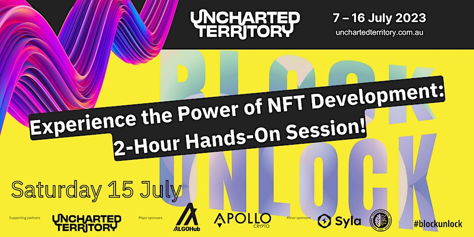

# Preparing Asset to Tokanise

First, we need to get our asset/item ready to be tokanised. In this example, we will create an NFT for the artwork used as the workshop advertising banner. There's a copy of the banner in [img/banner.jpeg](./img/banner.jpeg). We'll use its URL as a unique representation of our asset's location.



While the unique URL is sufficient to create a link between the on-blockchain NFT and the banner, we might want to attach additional details/metadata to our asset. Following [ERC-721](https://ethereum.org/en/developers/docs/standards/tokens/erc-721/) - the de-facto standard for representing ownership of non-fungible tokens (NFTs) in Ethereum - metadata extension guidelines, we represent the asset metadata using the following JSON (JavaScript Object Notation) object:

```json
{
   "title":"Asset Metadata",
   "type":"object",
   "name":"Experience the Power of NFT Development Banner",
   "description":"Web banner used for Experience the Power of NFT Development workshop on Sat, 15 Jul 2023 12:30 PM - 2:30 PM AEST",
   "image":"https://github.com/dilumb/BlockUnlockNFT/blob/main/img/banner.jpeg",
   "size":113214
}
```

We can URL of this object (i.e., https://github.com/dilumb/BlockUnlockNFT/blob/main/metadata.json) as the URI (Uniform Resource Identifier) of the banner asset we want to tokanise.

If you want to use a different image, video, etc., as your asset to be tokanised, replace the `image` tag in the JSON with something related and update the URL.
