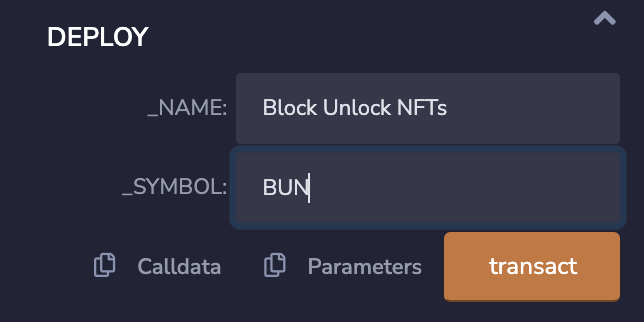
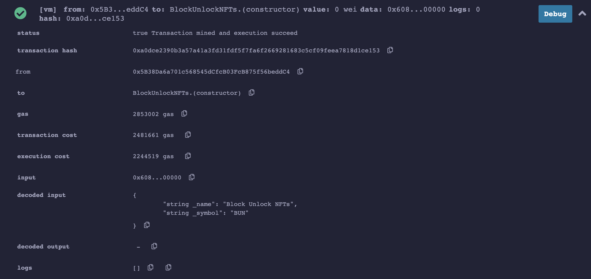
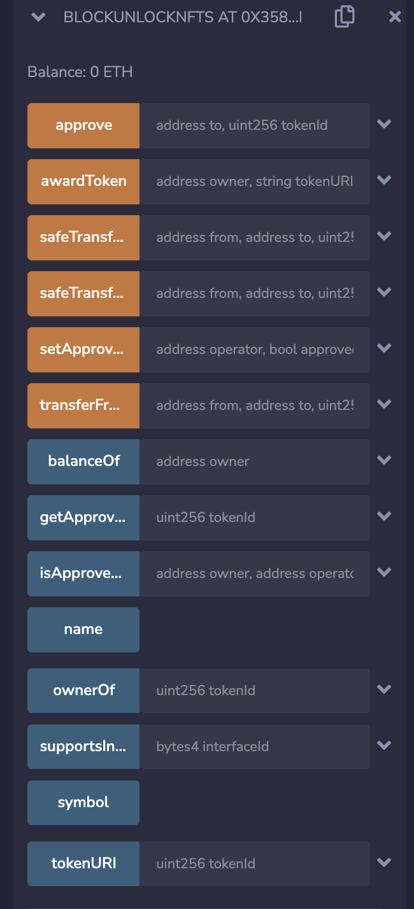

# Creating and Deploying NFT Smart Contract

## Creating NFT Smart Contract
[ERC-721](https://ethereum.org/en/developers/docs/standards/tokens/erc-721/) is the de-facto standard for representing ownership of non-fungible tokens (NFTs) in Ethereum. Rather than reinventing the wheel, we use the ERC-721 implementation from [OpenZeppelin](https://docs.openzeppelin.com/contracts/4.x/erc721) as it is one of the most robust and secure implementations of the standard. It is good practice to reuse time tested code to minimise bugs and security weaknesses. 

1. Using your favourite web browser, go to the [Remix IDE](https://remix.ethereum.org/). 

2. Click on the `File explorer` icon (symbol with 2 documents) from the set of icons on the left. Select the `contracts` folder - the default location for smart contracts in Remix. Then click on `Create new file` icon (small document icon), and enter `BlockUnlockNFTs.sol` as the file name. 

3. Copy the Solidity smart contract code from [`contracts\BlockUnlockNFTs.sol`](../contracts/BlockUnlockNFTs.sol) into Remix. This contract is used to keep track of our NFT collection. Solidity is an object-oriented programming language for implementing smart contracts on many blockchain platforms compatibel with the Ethereum virtual machine (EVM). 

In line 8, we import the `ERC721URIStorage` contract from the OpenZeppelin contract library. The ERC721URIStorage contract is an implementation of the ERC-721 standard that includes the metadata standard extensions (IERC721Metadata) and a mechanism to include per-token metadata. Next, we import the `Counters` utility contract that helps us assign incrementing identifiers to tokens we mint.

The `BlockUnlockNFTs` contract inherits `ERC721URIStorage` contract (see line 11), which in turn inherits `ERC721` contract. The `BlockUnlockNFTs` contract has a constructor that accepts the token collection name and symbol as inputs. These inputs are used to initialise the super constructor from the ERC721 contract. 

The `awardToken` function allows us to create (aka mint) a new token for a given URI that points to the metadata of the asset we want to toaknise. This interface accepts both the Ethereum address of the token owner and the URI of the JSON object that describes the asset. 

Within the function, we get the next token identifier (ID) from `_tokenIds`, which is an instance of the `Counter` contract. The token owner's address and token ID are then utilised to mint a new token using the `_mint` function. The `_setTokenURI` function keeps track of the token ID and the URI it corresponds to. Finally, we increment the token ID counter and return the token ID assigned to the new NFT. The `_mint` function comes from the `ERC721` contract while the `_setTokenURI` comes from the `ERC721URIStorage`.

4. Click on `Solidity compiler` menu option on the left. Set the compiler options are as follows:
  * Compiler - `0.8.5+....` (any commit option should work)
  * In `Advanced Configurations` select `Compiler configuration`:
    * Language - `Solidity`
    * EVM Version - `default`
  * Make sure `Hide warnings` is not ticked. Others are optional.

5. Then click on the `Compile BlockUnlockNFTs.sol` button. Carefully fix any errors and warnings.

## Testing NFT Smart Contract
First, let us test our smart contract on the Remix JavaScript VM (virtual machine) to ensure that it can be deployed without a problem. Remix JavaScript VM is a simulated blockchain environment that exists in your browser. It also gives you 10 pre-funded accounts to test contracts. Such simulated testing helps us validate a smart contract's functionality and gives us an idea about the transaction fees.

1. Select `Deploy & run transactions` menu option on the left. Then set the options as follows:
  * Environment - `Remix VM (Shanghai)`
  * Account - Pick one of the accounts with some Ether (the default should be ok) - Ether is the base cryptocurrency of Ethereum
    * Gas Limit - `3000000` (use the default)
    * Value - `0` (we are not transferring any Ether to the smart contract)
    * Contract - `BlockUnlockNFTs.sol`

2. In the textbox next to the `Deploy` button where you see `string _name, string _symbol` enter a name and symbol for our token collection. You can enter it as a single string like `Block Unlock NFTs,BUN`. Or you can expand the textbox into 2 textboxes by clicking on the icon to the right and entering each value.

3. Click on the `Deploy` button (or click on `transact` if you expanded the textbox). This should generate a transaction to deploy our contract. As seen in the following screenshot, you can check the transaction details and other status information, including any errors at the bottom of Remix (called *Remix Console* area). Click on the `^` icon next to the `Debug` button at the bottom left of the screen. Note values such as `status`, `contract address`, `transaction cost`, and `execution cost`. 

4. As seen in the next figure, you can interact with the deployed contract using the functions under `Deployed Contracts`. Expand the user interface by clicking on the `>` symbol where it says `BLOCKUNLOCKNFTS AT 0X...`. You will see a bunch of buttons and textboxes like the following:

Those buttons can be used to generate transactions to invoke respective functions on our NFT collection contract. For example, by clicking on the `name` and `symbol` buttons, you can see the token collection's name and symbol. 

When you click the button, Remix issues a transaction to invoke the getter function that returns these values. *Getter* functions are read-only (when the compiler generates them, they are marked as `view` only functions), so they are executed only on the node where the transaction is submitted. A read-only transaction does not require transaction fees as it is not executed across the blockchain network. 

5. Next, we mint a token for the workshop banner. Expand the textbox next to the `awardToken` button.

6. We'll assign our token to a different address than the one you used to deploy the NFT contract. Go to the `ACCOUNT` drop-down list and select any address other than the one that you used to deploy the contract (typically 1st one). Copy that address by clicking on the copy icon. After copying, reselect the address used to deploy the contract from the drop-down (i.e., 1st address). Paste that copied address into the `owner` textbox.

7. Enter https://dilumb.github.io/resources/metadata.json into `tokenURI` textbox. If you wish to use a different asset put the URI of the respective JSON object.

8. Click the `transact` button. This should generate a new transaction and you can see the transaction details on Remix console. Note that our NFT is assigned token ID of `0`.

9. Use `ownerOf` function to find out the owner of token `0`. This should be the same as the address you used in Step 6. Similarly, check the token URI using the `tokenURI` function. It should return the URL of our JSON object.

## Deploying NFT Smart Contract
Now that the BlockUnlockNFTs contract is working as expected, let us deploy it to the Ethereum Sepolia testnet. We need a digital wallet to create and issue Ethereum transactions. Also, we need test Ether to deploy and interact with the contract.

In this workshop, we use MetaMask, a browser-based, easier-to-use, and secure way to connect to blockchain-based applications. Once the account is created, we will fund it using an already deployed faucet smart contract on the test network. We also use Etherscan.io - a blockchain explorer or search engine for Ethereum data - to check the transaction details.

1. If MetaMask is not already installed or you haven't fund your account, please follow 2nd and 3rd steps at [Before the Workshop](../docs/BeforeWorkshop.md). Also, make sure `Ethereum Sepolia testnet` is selected as the default network on MetaMask.

2. Return to the Remix IDE. In the `Deploy & run transactions` pane, change the Environment drop-down list to `Injected Provider - Metamask`. If you do not see MetaMask, you will need to reload Remix IDE. The first time, MetaMask will pop up asking you to connect with Remix. Make sure your address is set as the `Account`. Follow the instructions to complete linking MetaMask with Remix IDE.

3. Click on the `Deploy` button to deploy the contract. MetaMask will pop up again, asking you to confirm the transaction to deploy the contract. 

You will see that MetaMask has already set a transaction fee. If it is set to `0`, change the value by clicking on the `Edit` link. This will list some suggested gas prices (this is how we pay transaction fees in Ethereum) based on the expected time to include a transaction in a block. Then click on the `Confirm` button. 

This will generate and send a transaction to the Sepolia testnet. You can find a link to Etherscan with the transaction ID on the Remix Console. Click on the link and wait till the transaction is included in a block. When the Status is `Success`, your smart contract is successfully deployed onto the test network. Carefully go through the transaction parameters. Note down the `To` address, which is the address of our contract. If you lose it, it is impossible to access the contract. 

If the `Success` status is marked as `Failed`, check the error messages on the Remix Console. Do the needful to fix the error and attempt to redeploy the contract.

Congratulations on deploying your first smart contract to a global network!
